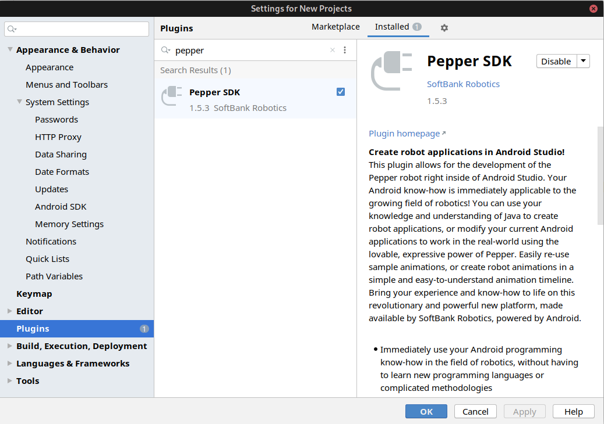

# Installing
1. Install Android Studio
2. Install the Pepper SDK plugin for Android Studio (Tools->SDK Manager->Plugins-> search "pepper")
3. Clone this repository using android studio Version Control (File->New->Project From Version Control ...")

# Running the code on an emulated pepper robot
1. Launch the emulator (Tools->Pepper SDK->Emulator) Note: if the emulator does not run see troubleshooting below
2. Select the Virtual Device as shown below 
3. Click the Green Play button.
4. Progress of build and install will be shown at the bottom of Android Studio

# Running the code on an physical pepper robot
1. Connect to Tammy by using the IP address of the Tablet. (not the IP of the robot) (Tools->Pepper SDK->Connect)
2. Enter the IP click OK
3. After it connects, a new device will show up in the drop down list.

# Troubleshooting
## Emulator not running
1. Go to "Pepper Plugin Settings" (Tools->SDK Manager->Tools->Pepper Plugin Settings)
2. Change Graphics to software 
3. Try running the emulator

## App is crashing while running on robot or emulator
1. With the app still running check "Logcat" tab at the bottom of Android Studio.
2. There should be some red text with information to help debug the code.

## Emulator stunk at 3%
1. Try to use a Intel processor computer, QiSDK does not support AMD ryzen CPUs.

## Emulator stunk at 20%-40%
1. The emulator does not support your computer, try another one.

# Useful links
1. https://developer.softbankrobotics.com/pepper-qisdk/pepper-qisdk-lessons
2. https://developer.softbankrobotics.com/pepper-qisdk/getting-started

